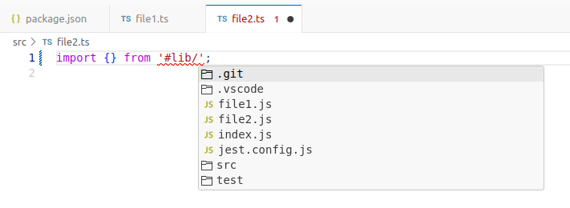

**Steps to reproduce the bug**

This repository is intended to reproduce a bug that manifests when the following three settings are combined:

1. `"rootDir": "."` in the `tsconfig.json` file, which is required only for VS Code and `eslint.config.mjs`;
2. `paths` in the `tsconfig.json` file creates an alias (subpath) for the path `#lib/*`, pointing to `./src/*`;
3. `imports` in the `package.json` file creates an alias (subpath) for the path `#lib/*`, pointing to `./dist/*`.

In such cases, TypeScript suggestions merge content from both the `./dist/*` and `./src/*` directories:

---

---

**Actual behavior**

As you can see, `file1.js`, `file2.js`, and `index.js` appear at the same level as the `src` and `test` folders, which is incorrect.

**Expected behavior**

1. The setting described in point 2 should take higher precedence for TypeScript over the setting in point 3.
2. In any case, the settings in points 2 and 3 should not be merged.

**Additional information about the issue**

If in point 1 the setting is changed to `"rootDir": "src"`, the bug disappears. However, in this case, you cannot use `"include": ["test"]` in the `tsconfig.json` file, which is very inconvenient. Instead, it is more practical to use the `"rootDir": "src"` setting in the `tsconfig.build.json` file.